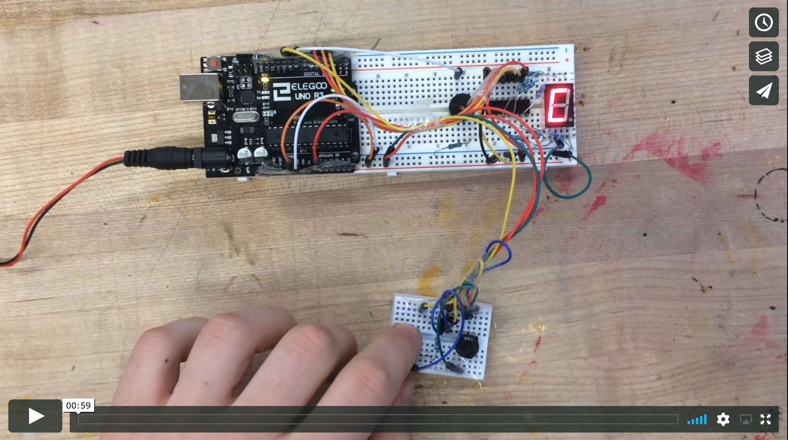

# Week Five

Today we're going to build a music note teacher. The device will play different notes for you to memorize and includes a quiz mode where you have to identify notes by ear.

## You will need:
- Arduino Uno
- Breadboard
- 7 Segment Display
- 10x 220 Ohm Resistor
- Buzzer
- Push Button
- Potentiometer
- Wires

## Circuit

This setup has a lot of wires, but this shouldn't deter you. It's mostly necessary for the 7 segment display, which is essentially seven LEDs in a box. In order to not use seven pins on the arduino for this, we're using a multiplexer. This is a chip that stores the states for all seven LEDs, but needs only three Arduino pins.

Please see [this tutorial](http://www.instructables.com/id/Multiplexing-7-Segment-displays-with-Arduino-and-S/) to learn how to multiplex a 7-segment-display.


The other parts of the setup don't need much explanation, since we've used the components in previous tutorials: there's a buzzer, a push button and a potentiometer.


## Code 
The code builds on previous examples, too. The `loop()` function starts with push button debouncing code and a snippet for reading the potentiometer.

[Click here for the full code.](WeekFive.ino)

The interesting part is the following:

```Arduino
// TRAINING MODE
  if(mode==0) {
    if(click) {
      // generate random digit
      i = (int) random(0,8);
    }
    // calculate bytes for shift register
    byte bits = numToBits(i);
    // display digit
    updateDisplay(bits);
    // play tone
    tone(piezoPin, numToTone(i), 100);
    delay(100);
    noTone(piezoPin);
  
  
  // TEST MODE
  } else {
    // new test number
    if(testModeState == 0) {
      i = (int) random(0,8);  
      testModeState++;
    }
    
    // play sound
    tone(piezoPin, numToTone(i), 100);
    delay(100);
    noTone(piezoPin);
    
    // calculate bytes for shift register
    byte bits = numToBits(poti);
    // display digit
    updateDisplay(bits);
   
   // click (=submit) -> check if right number
   if(click) {
     if(poti == i) {
       correctAnim();
       testModeState = 0; 
     } else {
       falseAnim();
     }
   }
  }
```

In *Training Mode*, the code plays random notes on the buzzer, displays their letter on the display, and switches to the next note on button click.  

A 2-second press switches between modes. 

In *Test Mode* the code also selects a random note and plays the tone, but doesn't show it on the display. Now the user can use the poti to dial to a tone he thinks is the one he hears. The button confirms the selection and the display afterwards gives a feedback if the guess was correct or false.

The key to make the display show numbers is the `updateDisplay()` function, which translates number inputs (e.g. 4) to display output ( B00000011 is note G). How this works is explained in the aforementioned multiplexer tutorial.

## Enclosure

My original plan was to solder the circuit on a PCB to make an Arduino shield which doesn't need wires. However, I had serious problems with the soldering. I have soldered many times before so I like to think it was not entirely my fault. In fact, but both soldering irons I tried at the Making Center didn't heat up properly at the tip which left me frustrated, with a burnt finger, and without an enclosure. Sorry about that!

## Video

[](https://vimeo.com/236828632/b814c7f964)