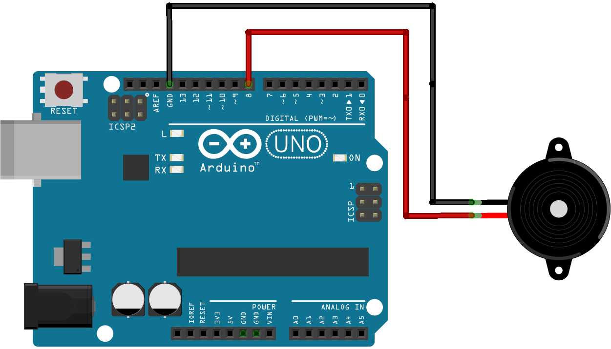

# Week Three

Today we're going to build an alternative Mine Sweeper game!

## You will need:
- Arduino Uno with Firmata Script loaded
- Breadboard
- 2 Wires
- 220 Ohm Resistor
- Buzzer
- Computer with Processing installed

## Getting started
First, wire the buzzer to any output pin and ground. You can also add a resistor to make the loise hurt less in your ears (aka. lower volume).


Here's the circuit in Fritzing (without the resistor, so that you can see both):



## Firmata
We're not going to write any specific Arduino code. Just install [Firmata](https://www.arduino.cc/en/Reference/Firmata) on it.

## Processing
Processing is going to do the heavy lifting today. Starting from the PWM firmata example sketch ([Code here](https://github.com/firmata/processing/blob/master/examples/arduino_pwm/arduino_pwm.pde)) we're adding a function to generate random locations in the sketch. These will be the hidden destinations, or mines to detect if you will.

```Processing
// in the top part of the sketch:
int hiddenX;
int hiddenY;

// in setup:
hiddenX = (int) random(0, width);
  hiddenY = (int) random(0, height);
  
// in draw:
int distance = (int) dist(mouseX, mouseY, hiddenX, hiddenY);
if( distance < 10 ) {
  hiddenX = (int) random(0, width);
  hiddenY = (int) random(0, height);
}

```

Take a look at the last part. This snippet calculates the distance from the mouse to the hidden mine and generates new random coordinates as soon the cursor is less than 10px away.

### Arduino Feedback
The beeping buzzer is what actually allows us to detect mines. Here, the buzz frequency increases as the cursor gets closer to the mine. This works using the following code (in Processing loop function):

```Processing
arduino.digitalWrite(3, 1);
delay(distance);
arduino.digitalWrite(3, 0);
delay(distance);
```

### Final Code
Here's the complete Processing code for our Mine Sweeper game:

```Processing
import processing.serial.*;
import cc.arduino.*;

Arduino arduino;

int hiddenX;
int hiddenY;

void setup() {
  size(600, 600);
  // Prints out the available serial ports.
  // println(Arduino.list());
  arduino = new Arduino(this, Arduino.list()[7], 57600);
  
  hiddenX = (int) random(0, width);
  hiddenY = (int) random(0, height);
}

void draw() {
  
  int distance = (int) dist(mouseX, mouseY, hiddenX, hiddenY);
  
  // if found, generate new location
  if( distance < 10 ) {
    hiddenX = (int) random(0, width);
    hiddenY = (int) random(0, height);
  }
  
  arduino.digitalWrite(3, 1);
  delay(distance);
  arduino.digitalWrite(3, 0);
  delay(distance);
}
```

## Video

[](https://vimeo.com/234533327/eeb045ec8c)