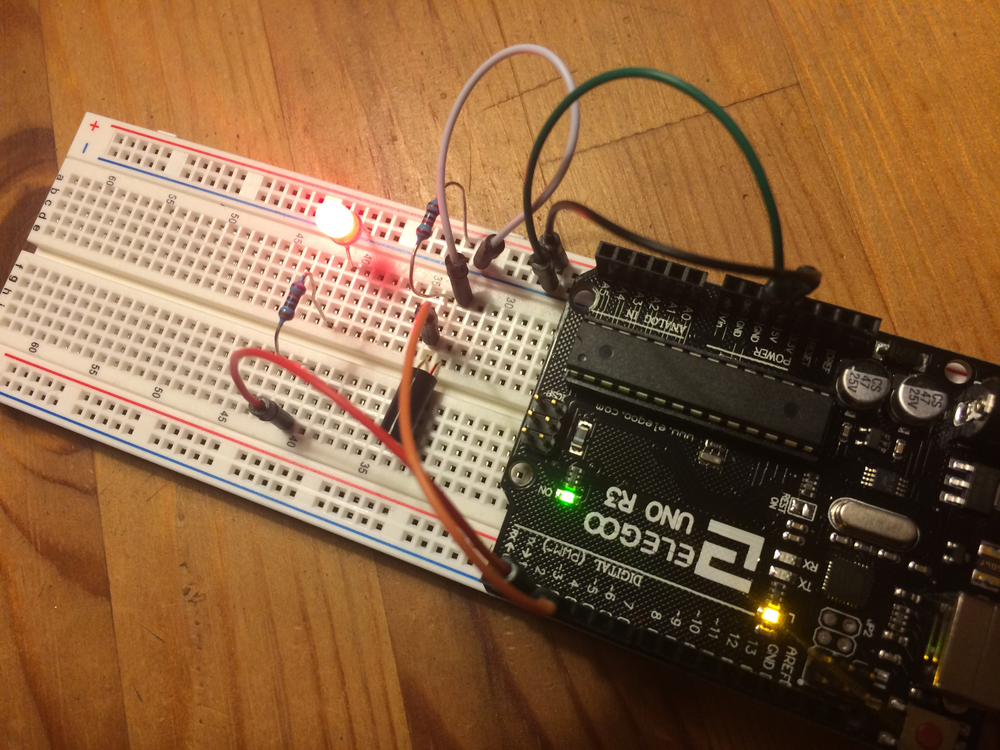
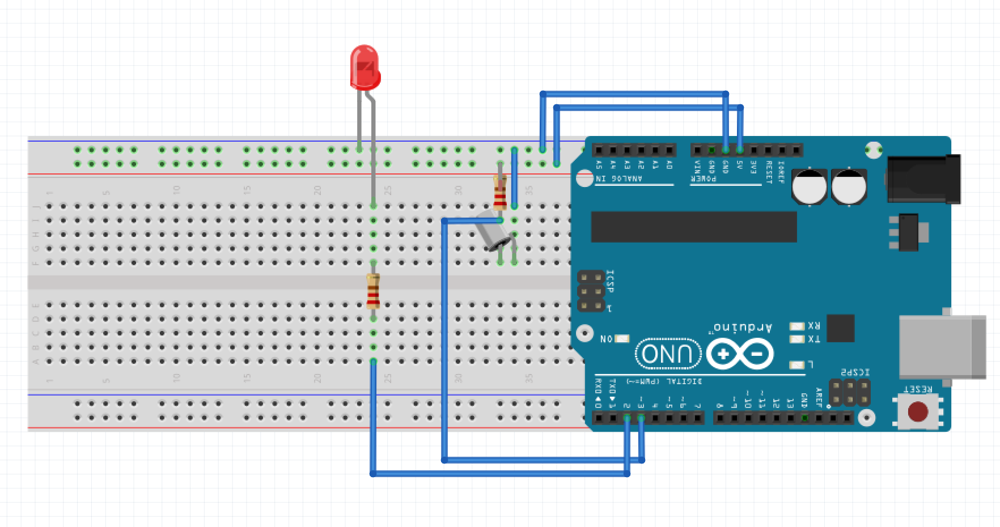
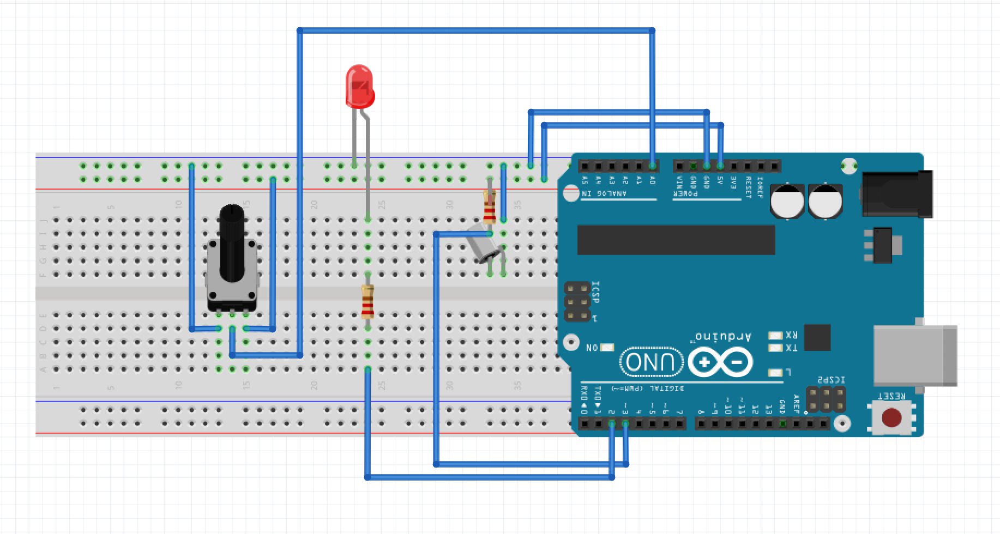
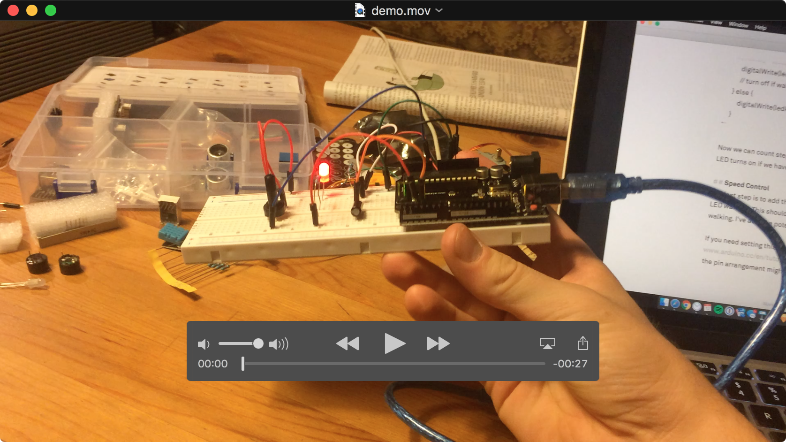

Today we're going to build a step counter for athletes!

## You will need:
- Arduino Uno
- Breadboard
- Wires
- Resistors (in Ohm):
	- 10k
	- 220
- TiltSwitch
- Potentiometer

## Getting started
The sensor that actually counts steps is the tilt switch. It works like a push button in that its output is digital, so only *true* or *false*. However, it switches not on press but on tilt. Attach this to your pants and you can (hopefully) count steps!

Here's a test circuit to try the sensor. It's basically the Arduino push button example. Note that I'm using a 10k pullup resistor on the sensor.

  


## Feedback
While walking I want to have a feedback that helps me to keep my pace. Therefore I am adding a red LED that turns on as soon as I fall below my desired pace. Here's the circuit with the added LED.

I connected the LED to pin 2 in order to be able to control it from the Arduino.

  


## Code
Let's look into the code. The part for reading the tilt switch is very similar to the [Arduino Button](https://www.arduino.cc/en/Tutorial/Button) example. The major difference is that we don't wait for a press-release cycle like with the button, but every state change triggers an event. This event is the increment of the step counter variable `steps` by 1.

```Arduino
	// assign pins
	const int ledPin = 2;
	const int tiltPin = 3;

	int steps = 0;
	boolean tiltState = 0;
	boolean tilt = 0;
	long stepTime = 0;
	long lastStepTime = 0;

	void setup() {
		pinMode(ledPin, OUTPUT);
		pinMode(tiltPin, INPUT);
	}

	void loop() {
		// read current tilt
		tilt = digitalRead(tiltPin);
  
		// debouncing, to remove ... bouncy walking
		if(tilt != tiltState) {
			stepTime = millis();
		}
  
 		// increment steps after debouncing
		if( millis() - stepTime > 40 ) {
			tiltState = tilt;
			steps++;
			tiltState = !tiltState;
			// record time of current step
			lastStepTime = millis();
		} 
	}
```

Let's add a piece of code in the loop to turn on the LED when I'm walking too slow. In setup, add `int stepInterval = 1000;` and at the bottom of the loop function, add the following snippet:

```
	// control LED
	// turn on if last step was too long ago
	if( millis() - lastStepTime > stepInterval ) {
		digitalWrite(ledPin, HIGH);
  		// turn off if walking fast enough
  	} else {
    	digitalWrite(ledPin, LOW);  
  	}
```

Now we can count steps by tilting the breadboard. Notice how the red LED turns on if we haven't made a step in the last 1000ms!

## Speed Control
The last step is to add the option to set a faster or slower speed for the LED warning. This should help us to use the device for running or walking. I've added a potentiometer that allows us to set the speed.

If you need setting this up, look at the [Arduino potentiometer](https://www.arduino.cc/en/tutorial/potentiometer) tutorial. But be aware that the pin arrangement might be different for the poti you're using!

To enable the poti, we just have to map its analog-in value to the stepInterval we defined earlier. Put this snippet in loop to do that: `stepInterval = map(analogRead(A0), 0, 1024, 100, 2000);`

## Final Result

  


Take a look at this video. I couldn't attach the device to my leg, because my USB cable was too short. Therefore I am replicating the walking/running motion by shaking the board in the same axis my leg would.

[](https://vimeo.com/233597605/51449cd05d)

Finally, [here's the complete code](WeekThree.ino).
